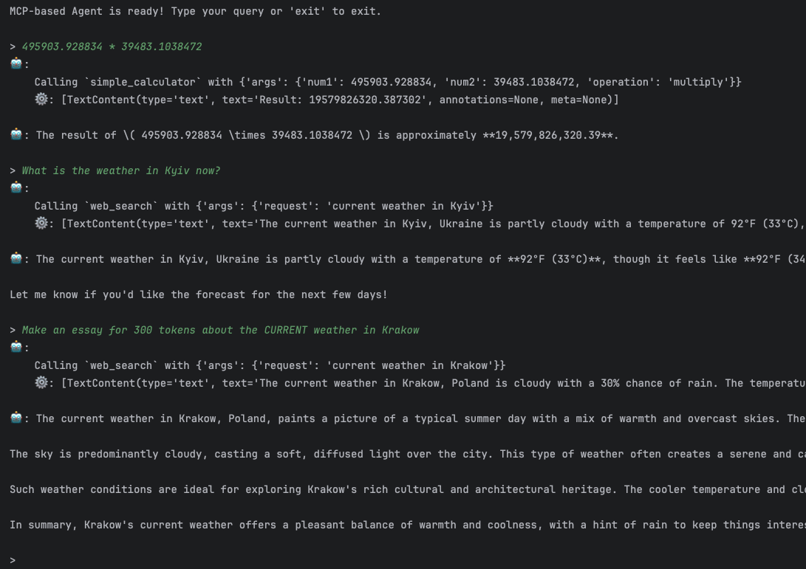

# Framework-based MCP (Server & Client)
Python implementation for building Agent with MCP tools and MCP server/

## 🎯 Task Overview

Create and run MCP server with simple tools. Implement simple Agent with MCP Client that will use MCP tools from created server.

## 🎓 Learning Goals

By exploring and working with this project, you will learn:

- How to configure simple MCP server
- How to configure client and connect to MCP server
- How to create simple Agent with tools from MCP server
- Key features of MCP

## 🏗️ Architecture

```
task/
├── agent/
│   ├── models/           
│   │   ├── message.py        ✅ Complete
│   ├── app.py                🚧 TODO: implement logic
│   ├── dial_client.py        🚧 TODO: implement logic
│   └── mcp_cleint.py         🚧 TODO: implement logic
└── mcp_server/               
    ├── server.py             🚧 TODO: implement logic
    ├── Dockerfile            ✅ Complete
    └── docker-compose.yml    ✅ Complete
```

## 📋 Requirements

- **Python**: 3.11 or higher
- **Dependencies**: Listed in `requirements.txt`
- **API Access**: DIAL API key with appropriate permissions
- **Network**: EPAM VPN connection for internal API access
- Docker and Docker Compose
- Postman

## ✍️ Tasks:

### Create and run MCP server:
1. Open [mcp_server](mcp_server/server.py)
2. Implement all ***TODO***
3. You need to add `DIAL_API_KEY` as env variable locally
4. Run it in docker compose:
    ```bash
    cd ./mcp_server/
    ```
    ```bash
    docker compose up -d
    ```
5. Verify that it is up:
    ```bash
    docker compose ps -a
    ```

### Optional: Work with MCP server in postman
1. Import [mcp.postman_collection](mcp.postman_collection.json) to Postman
2. Make `init` call and get `mcp-session-id` in response headers
3. Make `init-notification`. Pay attention that you need to use `mcp-session-id` retrieved from `init` request. it should return 202 status
4. Get tools (don't forget about `mcp-session-id`). It should return stream with tools.
5. Call calculator (don't forget about `mcp-session-id`). It should return stream tool execution result.


### Create and run Agent:
1. Open [mcp_client](agent/mcp_client.py) and implement all ***TODO***
2. Run application [mcp_client](agent/app.py) and test that it is connecting to MCP Server and works properly


## 🧪 Testing:
```text
495903.928834 * 39483.1038472
```
```text
What is the weather in Kyiv now?
``` 
```text
Make an essay for 300 tokens about the CURRENT weather in Krakow
```
### Result:


---
# 